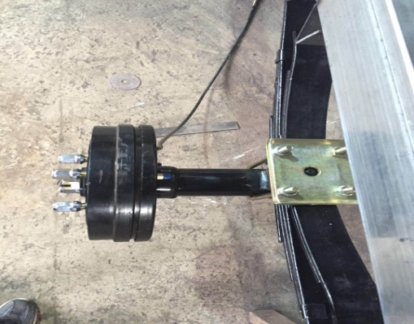

# 装配流程图示

## 车架设计

## 零件装配

用钢板支架和软连接将钢板固定（此图为左前方示意图）

钢板的另一端，放入钢板套，用销子固定在大拉耳上

底盘的高矮决定钢板装在桥的上下

拉耳焊在桥上的距离和下面钢板铆钉到铆钉的距离要一致
底盘高矮
（注意前后桥拉耳位置，千万不要焊反了）

将U型丝穿过桥，用五孔板螺丝固定住

方向机斜向焊在前桥上 焊的位置要跟球头金色拉杆保持水平，以免开车时打颤

组合开关 方向盘装在一起，注意前后位置，千万不要装反了

下柱的两端，一端连在上柱，另一端连在方向机

油泵，脚踏板，顶杆，断电开关装好备用，装在方向盘下面位置

依次排列：仪表 加速器 油壶 前车喇叭 倒顺开关 转换器安装所在位置

总：

## 调试
