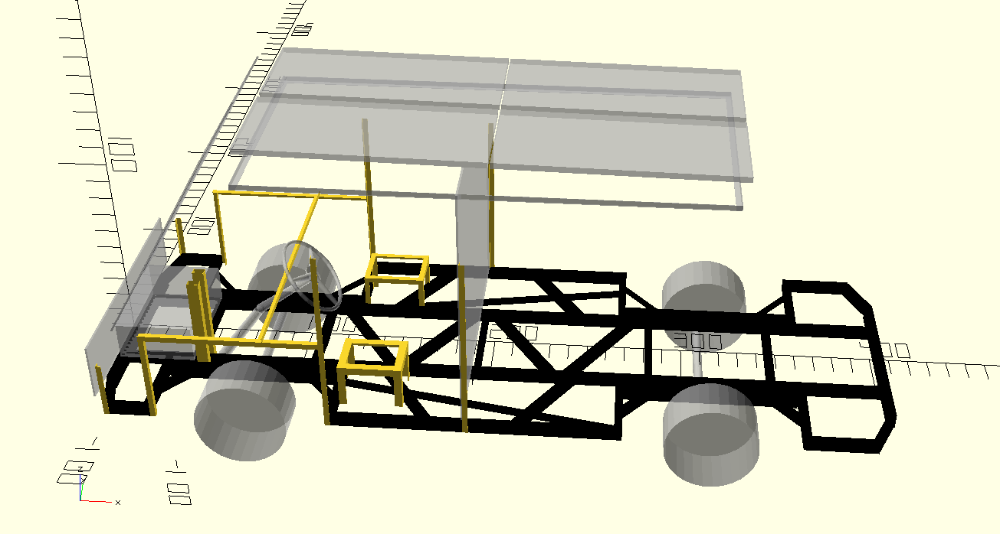
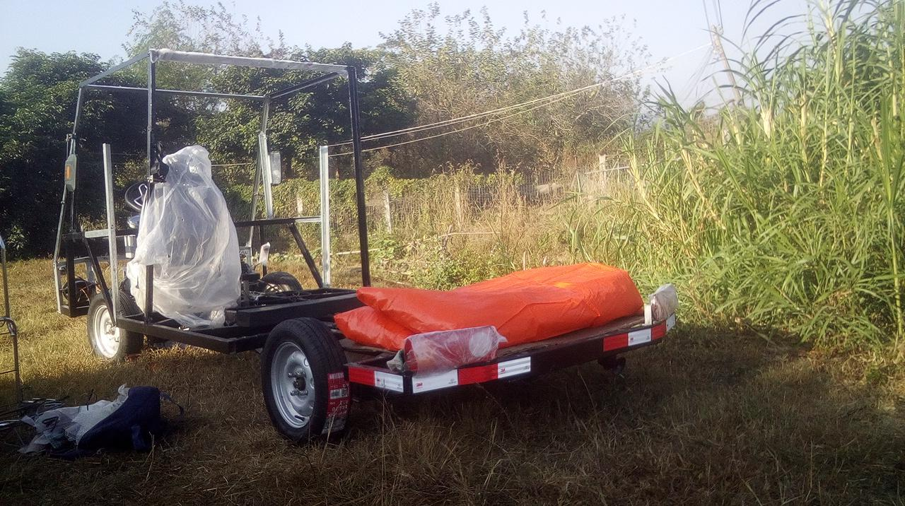

KuaFu - Approach to Future Electrical Vehicle 
=============================

created by: jobinson99(jobinson99@hotmail.com) 20190504

## Introduction

Kuafu is a project to produce an electrical vehicle from scratch, including the design, the component purchase, the assembling, the improvement and reformation of the present technology.

## Preparation

Design Tools: Openscad

Component List:
- Front axle
- Rear axle
- motor controller
- wheel
- shock absorber: steel plate
- route
- brake: dish and drum
- composed switch
- backward and forward switch
- accelerator
- meter
- transformer: 48v/60v to 12v
- snail horn 
- backward alert horn
- charger
- hanger
- headlight
- backlight
- direction light
- lock
- water blower
- rearview mirror

- Steel

Assembling Tools:

- incise:
- weld:
- drill: 8mm, 10mm, 25mm
- tap:
- wrench: 8mm, 10mm, 20mm

Helpful but unnecesaary:
- uplift:  windlass
- hold: vice

## The Design

v201812-20190913 design preview

### Version

- v201812 barebone
- v20190504 add Solar Energy roof, Reforming the Skeleton.
- v201909 in order to quicker assembling, the skeleton shift to cold-formed thin-walled steel, link with screw bolt
- v201911 modify the single vehicle to main carrier with one or more trailer.
- vz backup electrical system, backup brake, thermal system, renovation of the operation system, fiber enhanced resin.

Actually, 3 version provided:
- commonly implemented, steel.
- [recommanded]main carrier with trailer, steel. Practical, easy implemented, fast assembling, cost-less, extensible.
- main carrier with trailer, fiber enhanced.

## Assembling Process

## TODO

to be transcribed and published!

## License

